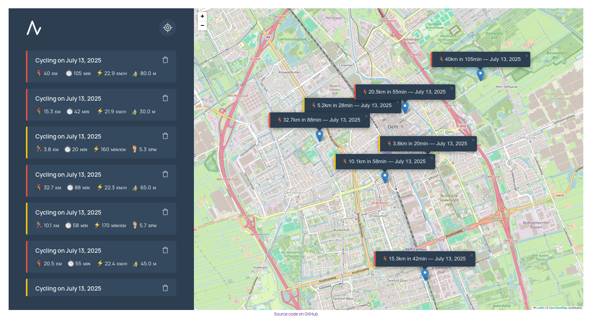

#  TrekTrack 🗺️


TrekTrack is a modern, web app that allows you to log and visualize your running and cycling workouts on an interactive map.



## ✨ Features

- **Interactive Map**: Uses Leaflet.js to provide a dynamic map interface.
- **Geolocation**: Pinpoints your current location to easily log workouts nearby.
- **Workout Tracking**: Log running or cycling workouts with details like distance, duration, cadence, and elevation gain.
- **Data Persistence**: All workout data is saved to the browser's local storage, so your information is available whenever you revisit the app.
- **Workout Deletion**: Easily remove workouts you no longer wish to track.

## 🛠️ Built With

- Vanilla JavaScript
- [Leaflet.js](https://leafletjs.com/) - An open-source JavaScript library for mobile-friendly interactive maps.
- [Cloudflare Workers](https://www.cloudflare.com/developer-platform/products/workers/) - For serverless deployment and logic.

## 🚀 Getting Started

```sh
git clone https://github.com/luiisca/TrekTrack.git
cd TrekTrack
npm install
npm run dev
```

This will start a development server, and you can view the application in your browser at the local address provided in the terminal.

## 🌐 Demo

http://trektrack.luiisca.workers.dev
